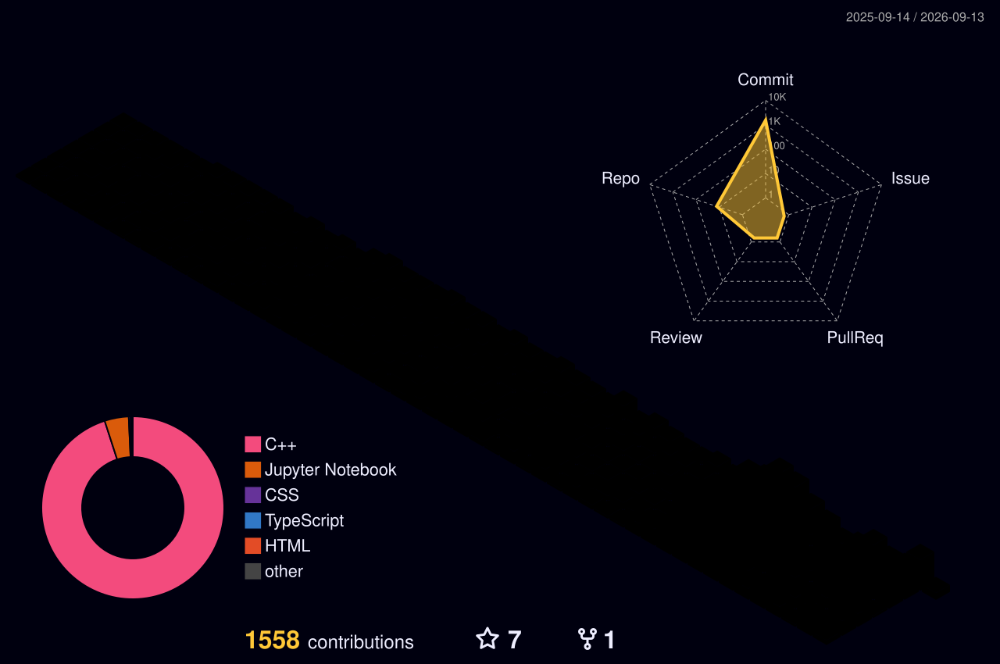

# 

<p align="center">
  
  <a href="https://github.com/Ritik-0102?tab=followers"></a>
  <a href="https://github.com/Ritik-0102?tab=repositories"></a>
</p>

<p align="center">
  
</p>

<p align="center">
  
  
  
  
</p>

<p align="center">
  
</p>

## `> about_me.exe`

<p align="center">
  
</p>

I’m **Ritik Rana**, a B.Tech Computer Science & Engineering student focused on turning curious ideas into practical software.

- Building across the **MERN stack** with React, JavaScript, Node.js, Express, MongoDB, and SQL.
- Exploring **Generative AI** and how intelligent interfaces can make web products more useful.
- Learning cloud delivery with **AWS**, containers with **Docker**, and strong engineering workflows.
- Keeping my foundations sharp through **DSA**, problem-solving, and software engineering practice.
- Interested in cybersecurity and the habits behind building more secure applications.

> **My coding philosophy:** start with a real problem, make the smallest useful version, learn from every bug, and keep iterating until it earns its place.

## `> engineering_loop`

<p align="center"><code>BUILD</code> ━━▶ <code>LEARN</code> ━━▶ <code>EXPERIMENT</code> ━━▶ <code>DEBUG</code> ━━▶ <code>IMPROVE</code> ━━▶ <code>SHIP</code></p>

| Signal | How I approach it |
| :-- | :-- |
| **Build** | Turn an idea into a working, testable feature. |
| **Learn & experiment** | Explore the tools behind the feature, not just the syntax. |
| **Debug & improve** | Treat failures as feedback for a cleaner next iteration. |
| **Ship** | Finish useful work and carry the lessons into the next build. |

## `> tech_arsenal`

| Domain | Toolkit |
| :-- | :-- |
| **Languages** |  |
| **Frontend** |  |
| **Backend** |  |
| **Databases** |  |
| **Cloud & DevOps** |  |
| **Tools** |  |

## `> featured_work`

<table>
  <tr>
    <td width="50%" valign="top">
      <h3>🌦️ WeatherGPT</h3>
      <p>AI-powered conversational weather intelligence. A product direction combining a React experience, FastAPI services, weather data, and LLM-assisted conversations.</p>
      <sub>REACT · FASTAPI · WEATHER APIs · AI / LLM</sub>
    </td>
    <td width="50%" valign="top">
      <h3>🩺 Vitalis AI</h3>
      <p>A domain-focused Generative AI healthcare chatbot concept exploring multimodal interaction and thoughtful AI integration in a web application.</p>
      <sub>GENERATIVE AI · CHATBOT · MULTIMODAL · WEB</sub>
    </td>
  </tr>
  <tr>
    <td width="50%" valign="top">
      <h3>🛒 EpicCart</h3>
      <p>A full-stack e-commerce build centered on products, authentication, carts, checkout, payments, and orders—with deployment-minded architecture.</p>
      <sub>MERN · AUTHENTICATION · DOCKER · CLOUD / CI-CD</sub>
    </td>
    <td width="50%" valign="top">
      <h3>🛡️ Security Vulnerability Detection Framework</h3>
      <p>An educational operating systems and cybersecurity project for studying vulnerability simulation and secure-system concepts.</p>
      <sub>C / C++ · OPERATING SYSTEMS · CYBERSECURITY</sub>
    </td>
  </tr>
</table>

## `> github_command_center`

<p align="center">
  
  
</p>

<p align="center">
  
</p>
<p align="center">
  
  
</p>
<p align="center">
  
</p>

## 📈 My Coding Activity

<p align="center">
  
</p>

## `> contribution_dimension`

<p align="center">
  
</p>

<!-- Contribution snake is intentionally hidden for now. Restore this block when ready to display it.
<picture>
  <source media="(prefers-color-scheme: dark)" srcset="profile-snake/github-contribution-grid-snake-dark.svg" />
  <source media="(prefers-color-scheme: light)" srcset="profile-snake/github-contribution-grid-snake.svg" />
  
</picture>
-->

## 📡 Developer Radar

| Currently exploring | Direction |
| :-- | :-- |
| React | Modern, responsive frontend experiences |
| Node.js & Express | Backend development and API design |
| MongoDB & MySQL | Practical database design |
| Generative AI | LLM-powered applications |
| AWS | Cloud deployment fundamentals |
| Docker | Repeatable, containerized environments |
| DSA | Stronger problem-solving habits |
| Cybersecurity | More secure applications and systems |

## `> 2026_learning_mission`

> These are **learning-focus signals**, not proficiency scores.

| Focus | Current mission |
| :-- | :-- |
| Frontend | `████████░░` Craft polished React interfaces |
| Backend | `████████░░` Design dependable APIs and services |
| Databases | `███████░░░` Model data for real product needs |
| DSA | `███████░░░` Practice patterns that improve problem solving |
| AI | `████████░░` Build useful Generative AI experiences |
| Cloud | `██████░░░░` Learn deployment and scalable-system foundations |
| System Design | `██████░░░░` Understand how product pieces fit together |

## `> developer_operating_system`

```text
INPUT       → curiosity + a real-world problem
PROCESS     → research → prototype → feedback → refinement
OUTPUT      → a clearer, more useful product
UPGRADE     → one lesson carried into the next build
```

I’m growing from student to engineer by making the work tangible: one feature, one experiment, and one shipped project at a time.

## `> let_s_connect`

<p align="center">
  <a href="https://github.com/Ritik-0102"></a>
  <a href="https://www.linkedin.com/in/ritik--rana/"></a>
  <a href="mailto:ritikrana.dev@gmail.com"></a>
  <a href="https://leetcode.com/u/Ritik-Rana/"></a>
  <a href="https://ritikrana.netlify.app/"></a>
</p>

<p align="center"><i>Open to connecting with builders, learners, and people solving interesting problems.</i></p>


<p align="center"></p>
